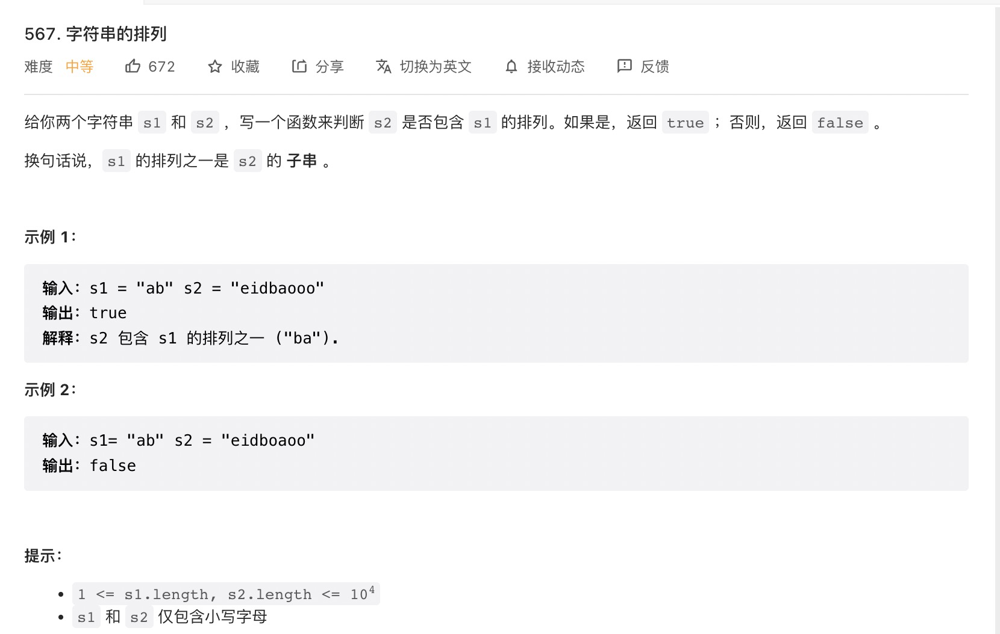

### question


### answer
#### 滑动窗口
```js
var checkInclusion = function (s1, s2) {
  const n = s1.length, m = s2.length;
  if (n > m) {
    return false;
  }
  const numMap = new Array(26).fill(0);
  for (let i = 0; i < n; ++i) {
    ++numMap[s1[i].charCodeAt() - 'a'.charCodeAt()];
    --numMap[s2[i].charCodeAt() - 'a'.charCodeAt()];
  }
  let diff = 0;
  numMap.map(item => diff += item === 0 ? 0 : 1);
  if (diff === 0) {
    return true;
  }
  for (let k = n; k < m; ++k) {
    const x = s2[k - n].charCodeAt() - 'a'.charCodeAt(), y = s2[k].charCodeAt() - 'a'.charCodeAt();
    if (x === y) {
      continue;
    }
    if (numMap[x] === 0) {
      ++diff;
    }
    ++numMap[x];
    if (numMap[x] === 0) {
      --diff;
    }
    if (numMap[y] === 0) {
      ++diff;
    }
    --numMap[y];
    if (numMap[y] === 0) {
      --diff;
    }
    if (diff === 0) {
      return true;
    }
  }
  return false;
};
```

#### 双指针